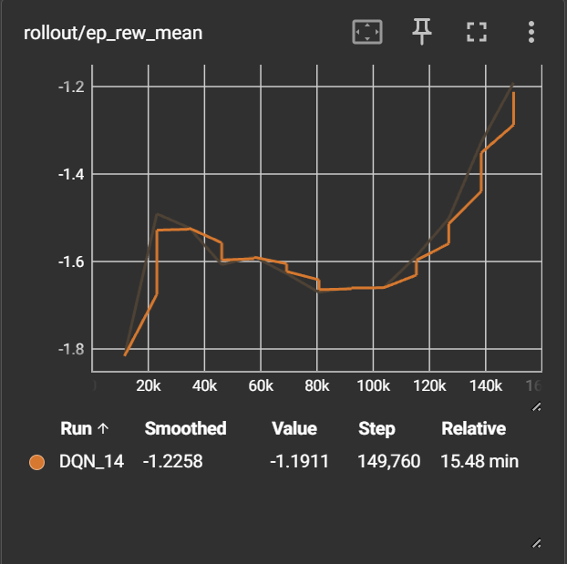
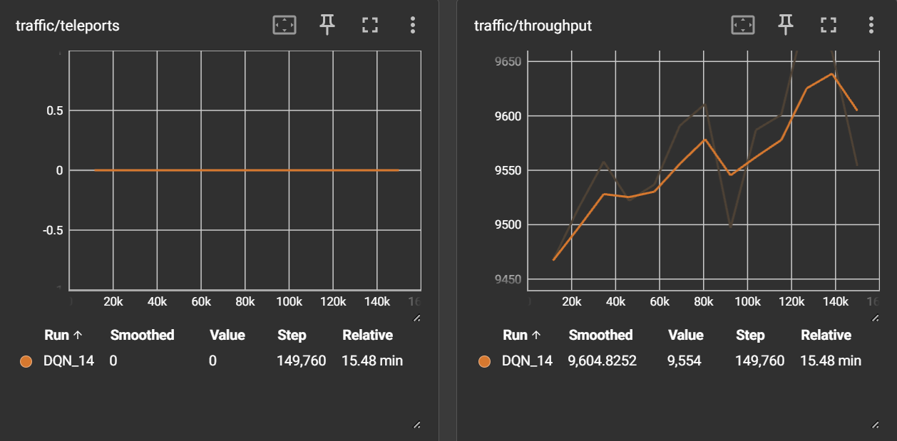

[README.md](https://github.com/user-attachments/files/31080278/README.md)
# Multi-Agent DQN for SUMO Traffic Signal Control

A shared-parameter DQN agent that learns to control traffic lights across a multi-junction SUMO network, built on [PettingZoo](https://pettingzoo.farama.org/), [sumo-rl](https://github.com/LucasAlegre/sumo-rl), [SuperSuit](https://github.com/Farama-Foundation/SuperSuit), and [Stable-Baselines3](https://stable-baselines3.readthedocs.io/). Fully containerized with Docker Compose, with hyperparameter search via [Optuna](https://optuna.org/) + `MedianPruner`.


---

## Table of Contents

- [Overview](#overview)
- [Key Features](#key-features)
- [Results](#results)
- [Repository Structure](#repository-structure)
- [Getting Started](#getting-started)
  - [Option A: Docker Compose (recommended)](#option-a-docker-compose-recommended)
  - [Option B: Local install](#option-b-local-install)
- [How It Works](#how-it-works)
  - [Environment: PettingZoo + sumo-rl + SuperSuit](#environment-pettingzoo--sumo-rl--supersuit)
  - [Model: DQN](#model-dqn)
  - [Reward Design & Environment Gotchas](#reward-design--environment-gotchas)
  - [Hyperparameter Tuning: Optuna + MedianPruner](#hyperparameter-tuning-optuna--medianpruner)
- [Configuration](#configuration)
- [Troubleshooting](#troubleshooting)
- [Roadmap](#roadmap)
- [Acknowledgments](#acknowledgments)
- [License](#license)

---

## Overview

This project trains a **single shared DQN policy** to control every traffic light in a multi-junction SUMO network simultaneously. Rather than training one independent agent per intersection, every junction is treated as a parallel instance of the same underlying control problem, and all of them feed experience into one shared network — the traffic-signal-control equivalent of parameter sharing in multi-agent RL.

The environment is built on [`sumo-rl`](https://github.com/LucasAlegre/sumo-rl) (Lucas N. Alegre's SUMO/PettingZoo integration) rather than a hand-rolled TraCI wrapper. That choice came out of hitting a real failure mode with a custom environment first: with naive `setPhase()` calls and no minimum-green/yellow enforcement, the agent found it could reduce its own waiting-time penalty by driving the network into gridlock and letting SUMO's vehicle-teleport mechanism erase the evidence. `sumo-rl`'s built-in `min_green`/`yellow_time` handling and `time_to_teleport=-1` close both loopholes at the source — see [Reward Design & Environment Gotchas](#reward-design--environment-gotchas) for the full story, since it's the most useful part of this repo if you're building something similar.

Currently configured against the 4x4 grid network bundled with `sumo-rl` (16 signalized junctions), with the intention of porting the trained setup to a custom network once the pipeline is validated here.

## Key Features

- **Parameter-shared multi-agent DQN** — one policy, N traffic-light agents, via PettingZoo's Parallel API + SuperSuit's vectorization.
- **No custom TraCI plumbing** — observations, rewards, and system-level metrics (waiting time, queue length, throughput) come from `sumo-rl` directly.
- **Teleport-exploit-free by construction** — `time_to_teleport=-1` and a `diff-waiting-time` reward remove the specific reward-hacking path this project ran into early on.
- **Task-level metrics in TensorBoard**, not just proxy reward — `avg_waiting_time`, `avg_stopped`, `throughput`, and `teleports` are logged alongside the standard `rollout/`/`train/` charts, so you can check whether the proxy reward and the actual traffic outcome agree.
- **Optuna + MedianPruner hyperparameter search**, reusing training-time rollout metrics for pruning decisions rather than a separate expensive evaluation pass.
- **One Dockerfile, no local SUMO install required** — `docker compose run train` is the entire setup.

## Results





## Repository Structure

```
.
├── sumo_rl_env.py               # Environment factory: PettingZoo -> SuperSuit -> SB3 VecEnv
├── traffic_metrics_callback.py  # Logs avg_waiting_time / avg_stopped / throughput to TensorBoard
├── train.py                     # Trains the shared DQN policy, saves the final model
├── evaluate.py                  # Loads a saved model, runs one episode, reports metrics
├── tune_hyperparams.py          # Optuna + MedianPruner hyperparameter search
├── optuna_pruning_callback.py   # Reports rolling metrics to Optuna for pruning decisions
├── Dockerfile
├── docker-compose.yml
├── requirements.txt
└── README.md
```

## Getting Started

### Option A: Docker Compose (recommended)

This is the path that doesn't require installing SUMO, PettingZoo, or any Python dependencies on your machine at all — everything runs inside the container.

**Prerequisites**

- [Docker Desktop](https://www.docker.com/products/docker-desktop/) (Mac/Windows) — Compose is bundled automatically.
- On Linux: [Docker Engine](https://docs.docker.com/engine/install/) plus the [Compose plugin](https://docs.docker.com/compose/install/linux/) (`docker compose version` should print something; if it doesn't, install the plugin separately).
- No local SUMO, Python setup needed — the image is self-contained.

**Clone and build**

```bash
git clone https://github.com/<you>/Multi-Agent-SUMO-DQN.git
cd Multi-Agent-SUMO-DQN
docker compose build
```

**Run**

Four services are defined in `docker-compose.yml`, all built from the same image:

| Command | What it does |
|---|---|
| `docker compose run train` | Trains the shared DQN policy using the hyperparameters set in `train.py` (defaults to the best values found via Optuna). Saves the model to `models/` and logs to `logs/`. |
| `docker compose up tensorboard` | Serves TensorBoard on [localhost:6006](http://localhost:6006), reading from the same `logs/` volume — run this alongside `train` to watch metrics update live. |
| `docker compose run tune` | Runs the Optuna + MedianPruner hyperparameter search and writes results to `optuna_results.csv` plus two HTML report files. |
| `docker compose run evaluate` | Loads the saved model from `models/` and runs one evaluation episode, printing final traffic metrics. |

Typical first run:

```bash
docker compose run train          # train a policy
docker compose up tensorboard     # in another terminal: watch it live at localhost:6006
docker compose run evaluate       # check the trained policy's metrics
```

`models/`, `logs/`, and `optuna_results.csv` are bind-mounted to your working directory (see `docker-compose.yml`), so results persist after the container exits — nothing is lost when a `docker compose run` finishes.

> **Permissions note:** the container runs as a non-root user. If a bind-mounted `models/`/`logs/` directory was created by a different user on your host, you may hit a permission error on write. Either `mkdir -p models logs` yourself first with open permissions, or run with `--user "$(id -u):$(id -g)"` appended to the relevant `docker compose run` command.

### Option B: Local install

If you'd rather not use Docker:

```bash
# 1. Install SUMO
sudo add-apt-repository ppa:sumo/stable   # or use your distro's package manager
sudo apt-get update
sudo apt-get install sumo sumo-tools

# 2. Set SUMO_HOME (sumo-rl will not import without this)
echo 'export SUMO_HOME="/usr/share/sumo"' >> ~/.bashrc
source ~/.bashrc

# 3. Install Python dependencies
pip install -r requirements.txt

# 4. sumo-rl's PyPI release is currently incompatible with recent PettingZoo
#    (see Troubleshooting) -- install the fix from GitHub main instead:
pip install "git+https://github.com/LucasAlegre/sumo-rl.git"

# 5. Run
python train.py
tensorboard --logdir logs   # in another terminal
python evaluate.py
```

## How It Works

### Environment: PettingZoo + sumo-rl + SuperSuit

The number of agents in this environment is exactly the number of signalized junctions in the SUMO network which for our case is 16, for the bundled 4x4 grid. Each agent observes and controls one junction's traffic light phase independently, but all 16 run inside a single SUMO simulation.

`sumo-rl` exposes several environment parameters that matter a lot for realism and safety, and are worth understanding rather than leaving at their defaults:

- **`delta_time`** — how many simulated seconds pass between an agent's decisions. Agents don't get to act every simulation tick; this is what stops the policy from flipping a light every second, which is both unrealistic and unsafe.
- **`yellow_time`, `min_green`, `max_green`** — a minimum-green and mandatory-yellow-transition policy, applied automatically whenever the agent's chosen phase differs from the current one. The agent's action is simply ignored if not enough time has passed since the last switch.
- **`time_to_teleport=-1`** — disables SUMO's default behavior of forcibly removing ("teleporting") vehicles that have been stuck too long. If your reward function is built around minimizing waiting time (as this one is), leaving teleportation enabled creates a way in which our agent can game the system: gridlocking the network makes stuck vehicles disappear from the waiting-time statistics entirely, which looks like *improvement* to the reward function. setting teleport=-1 removes that shortcut — a stuck vehicle counts against you for as long as it's actually stuck.

**Stable-Baselines3 is fundamentally single-agent** — it expects one policy trained against a `VecEnv` of parallel, structurally identical environments, not a multi-agent environment. [SuperSuit](https://github.com/Farama-Foundation/SuperSuit) bridges this gap: `pettingzoo_env_to_vec_env_v1` presents each of the 16 agents as if it were one independent parallel environment, and `concat_vec_envs_v1(..., base_class="stable_baselines3")` wraps that into something SB3's `DQN` can train against directly. Under the hood there is still only **one** SUMO simulation — SuperSuit is reshaping the same simulation's per-agent results into the shape SB3 expects, not running 16 separate simulations.

> **Known SuperSuit gotcha:** `supersuit.vector.markov_vector_wrapper.MarkovVectorEnv.step()` auto-resets the underlying environment the instant an episode ends, and in doing so it merges the fresh post-reset info dict over the true terminal info dict — silently zeroing out any custom cumulative stats (like `sumo-rl`'s `system_total_arrived`) at exactly the step you'd want to read them. `sumo_rl_env.py` includes a small wrapper, `_FixResetClobberedInfo`, that caches each agent's pre-reset info and patches the correct values back in on the boundary step. Worth knowing if you extend the info dict further and decide to track some extra custom metrics.

### Model: DQN

Traffic state (queue lengths, waiting times, vehicle speeds) is continuous, so a general off-policy method like tabular Q-learning approach doesn't work here — the Q-table would grow without bound and never generalize since it's unlikely that we will see different states repeat. DQN replaces the table with a neural network function approximator, $Q(s, a; \theta)$, trained to predict expected return from any state-action pair.

Two standard DQN mechanisms are what make this stable enough to actually train:

**Experience replay.** Every transition `(s, a, r, s')` is stored in a replay buffer rather than used immediately. Training samples random minibatches from this buffer instead of learning from consecutive, highly-correlated simulation steps — Sampling minibatches allow us to feed data that fits the need for IID data for neural nets to generalize well.

**Target network.** The quantity DQN is trying to fit is

$$y = r + \gamma \max_{a'} Q(s', a'; \theta)$$

If the same network parameters $\theta$ are used to both produce this target and to compute the current prediction, every gradient update immediately shifts the target it was trying to hit — this is like chasing a target that keep moving this destabilizes training. DQN fixes this with a second network, $\theta^-$, updated by copying $\theta$ into it only every few thousand steps (this is a hyperparameter that we can tune as well), so the target changes far more slowly than the online network being optimized. This gives the loss:

$$L(\theta) = \mathbb{E}_{(s,a,r,s') \sim \mathcal{D}} \left[ \left( y - Q(s, a; \theta) \right)^2 \right], \quad y = r + \gamma \max_{a'} Q(s', a'; \theta^-)$$

### Reward Design & Environment Gotchas

This section is arguably the most useful part of this README if you're building something similar, since most of the real debugging time on this project went into getting the reward function and termination logic right rather than the DQN itself.

An earlier version of this environment used a hand-rolled TraCI wrapper with a raw penalty-sum reward (`-queue_length - waiting_time`) and an logical error in termination condition that treated *both* "all vehicles cleared" and "deadlock detected" as the same terminal state. That combination let the agent find a genuine reward hack: driving the network into gridlock caused SUMO's teleport mechanism to forcibly clear stuck vehicles, which erased their accumulated waiting time from the running statistics — making gridlock look like *good* performance to a reward function built around minimizing waiting time. Separately, allowing the agent to call `setPhase()` on every simulation step with no minimum-green or mandatory-yellow enforcement caused unrealistic instant phase switching, which triggered emergency braking throughout the network and made the gridlock scenario more likely in the first place.

`sumo-rl`'s defaults close both gaps structurally, not just numerically:

- `time_to_teleport=-1` removes the ability to make gridlock look good on the waiting-time metric.
- `min_green`/`yellow_time` enforcement removes the unsafe instant-switching behavior at the source.
- Episodes run for a fixed `num_seconds` of simulated time and then truncate — there's no "success" terminal state to reach at all, which means there's nothing for a sparse terminal bonus to attach itself to and get gamed.
- The default reward function, `diff-waiting-time`, measures the *decrease* in total accumulated waiting time since the last decision, rather than a raw penalty sum. This also avoids a more subtle issue with length-scaled proxy rewards: a raw per-step penalty summed over an episode conflates "how good was each decision" with "how many decisions did the episode contain," which makes episode-length changes look like policy-quality changes even when they aren't.

If you're extending this to your own SUMO network, the practical takeaway is: don't treat "unusual reward-vs-behavior mismatches" as necessarily a hyperparameter problem before checking whether the environment itself has a structural loophole like this one.


### Hyperparameter Tuning: Optuna + MedianPruner

Deep RL hyperparameter search is expensive — every trial is a full training run, and SUMO simulation steps are slow relative to most RL benchmarks. `MedianPruner` mitigates this by comparing a trial's intermediate performance against the median of all other trials at the same point in training, and stopping the trial early if it's falling meaningfully behind. This means bad hyperparameter combinations get cut off after a fraction of a full training run instead of wasting the full training budget on something that was never going to be competitive.

`tune_hyperparams.py` optimizes `avg_waiting_time` directly, rather than combining it with `avg_stopped`/`throughput` into an arbitrary weighted score — the pruner needs a single scalar, and the other two metrics are recorded as trial `user_attrs` so they're still inspectable per-trial afterward without conflating three differently-scaled quantities into one made-up number. Pruning decisions reuse the rolling average from training-time rollouts rather than running a separate held-out evaluation episode per report, which would roughly double search time given how expensive each SUMO episode already is.

`study.optimize(...)` writes results to `optuna_results.csv`, and (with `plotly` installed) an optimization-history and parameter-importance HTML report, so you can see which hyperparameters actually mattered rather than just the final winning combination.

## Configuration

The main knobs, and where to find them:

| Parameter                                             | Where                                                                                                                    | Effect                                                                                                                                |
| ----------------------------------------------------- | ------------------------------------------------------------------------------------------------------------------------ | ------------------------------------------------------------------------------------------------------------------------------------- |
| `net_file`, `route_file`                              | `sumo_rl_env.py` (`DEFAULT_NET_FILE`/`DEFAULT_ROUTE_FILE`), overridden in `train.py`/`tune_hyperparams.py`/`evaluate.py` | Swap to your own SUMO network once validated on the bundled 4x4 grid                                                                  |
| `delta_time`, `yellow_time`, `min_green`, `max_green` | `sumo_rl_env.build_env()`                                                                                                | Traffic signal timing constraints.                                                                                                    |
| `reward_fn`                                           | `sumo_rl_env.build_env()`                                                                                                | `sumo-rl` also ships `"queue"`, `"pressure"`, and `"average-speed"` reward functions if `diff-waiting-time` doesn't fit your use case |
| `desired_rounds`, `num_seconds`                       | `train.train()`                                                                                                          | Training length, in decision-rounds and simulated seconds respectively                                                                |
| DQN hyperparameters                                   | `train.py` (`DQN(...)` call)                                                                                             | Defaults are the best values found via `tune_hyperparams.py`; re-run tuning if you change the network or reward function              |

## Troubleshooting

- **`ImportError: Please declare the environment variable 'SUMO_HOME'`** — `sumo-rl` requires this set with no fallback default. Default apt install path is `/usr/share/sumo`.
- **`TypeError: 'module' object is not callable` on `agent_selector`** — you installed `sumo-rl` from PyPI (1.4.5). That release predates a PettingZoo rename (`agent_selector` → `AgentSelector`) and is broken against current PettingZoo. Install from GitHub main instead: `pip install "git+https://github.com/LucasAlegre/sumo-rl.git"`.
- **apt fails to install `sumo`/`sumo-tools` with 404s on unrelated packages** (e.g. `libmysqlclient21`, `libpq5`) — usually a stale package index rather than a real missing package; run `apt-get update` again immediately before the install.
- **Building on Windows** — Docker Desktop's WSL2 backend has slow I/O across the Windows/Linux filesystem boundary (`/mnt/c/...`). If your project currently lives on the Windows filesystem, cloning it into a native WSL2 path (e.g. `~/projects/...` inside your WSL distro) before running `docker compose build` will noticeably speed up builds. This isn't required for correctness, only build speed.
- **Permission denied writing to `models/`/`logs/`** — see the note under [Docker Compose](#option-a-docker-compose-recommended); the container's non-root user and your host user may not share a UID.


## Acknowledgments

This project builds directly on:

- [`sumo-rl`](https://github.com/LucasAlegre/sumo-rl) by Lucas N. Alegre
- [PettingZoo](https://pettingzoo.farama.org/) and [SuperSuit](https://github.com/Farama-Foundation/SuperSuit) (Farama Foundation)
- [Stable-Baselines3](https://stable-baselines3.readthedocs.io/)
- [Optuna](https://optuna.org/)
- [SUMO](https://www.eclipse.org/sumo/) (Eclipse Foundation / DLR)

If you use `sumo-rl` in your own work, consider citing it:

```bibtex
@misc{sumorl,
    author = {Lucas N. Alegre},
    title = {{SUMO-RL}},
    year = {2019},
    publisher = {GitHub},
    journal = {GitHub repository},
    howpublished = {\url{https://github.com/LucasAlegre/sumo-rl}},
}
```

